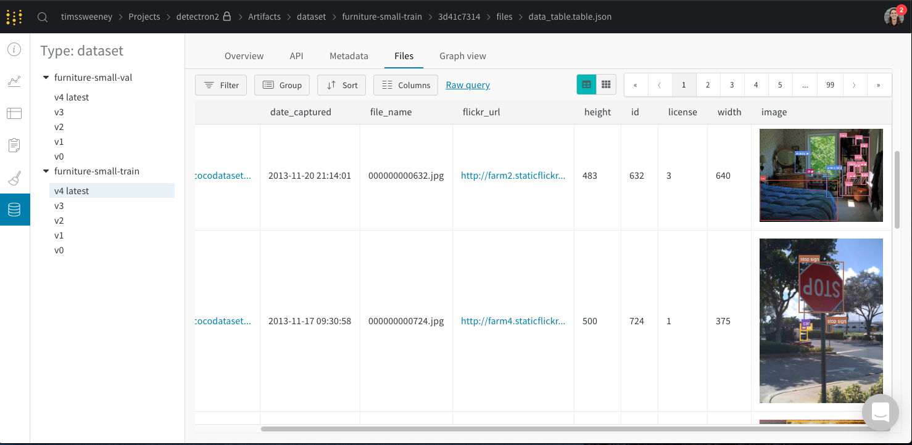

# Detectron2 + Weights & Biases

Build image models on your own datasets, with complete tracking and dataset management.

Using the code in this repo you can:

- Store and version your datasets using Weights & Biases
- Train Detectron2 models for image segmentation or bounding box prediction on W&B datasets
- Visualize training metrics & predictions in real-time
- Store and organize trained models
- Automatically keep track of model fine-tuning, including multiple stages of fine-tuning
- Track, store and visualize evaluation results

## Demo

You can follow these steps to work through a complete example, using the COCO dataset.

### Setup
First, install the necessary dependencies

```
pip install -r requirements.txt
```

You will also need to install Detectron2. Please follow instructions for your environment here: https://github.com/facebookresearch/detectron2/blob/master/INSTALL.md. For simple installs:

```
pip install 'git+https://github.com/facebookresearch/detectron2.git'
```

Finally, let's initialize a Weights & Biases project in this directory

```
wandb init
```

### Download Data
Next, you will download the COCO dataset:

```
cd demo && ./download_coco_val.sh
```

### Dataset creation
Now, we will create a training dataset and a validation dataset. Both datasets will be uploaded to Weights & Biases. In fact, we will be uploading "Artifacts" to Weights & Biases. An artifact is similar to a versioned folder of data. This way, we will store the data in the same way that the detectron2 library prefers it. Furthermore, we will also store a `wandb.Table` which generates a view of the data useful for visual analysis. 

```
# Create a 20% subset dataset called "furniture-small-train".
python create_dataset_unified_format.py \
  --name="furniture-small-train" \
  --json_file=demo/demodata/coco/annotations/instances_val2017.json \
  --image_dir=demo/demodata/coco/val2017 \
  --select_fraction=0.2 \
  --after_fraction=0.0

# Create a 10% subset dataset called "furniture-small-val" (selected after first 20%).
python create_dataset_unified_format.py \
  --name="furniture-small-val" \
  --json_file=demo/demodata/coco/annotations/instances_val2017.json \
  --image_dir=demo/demodata/coco/val2017 \
  --select_fraction=0.1 \
  --after_fraction=0.2
```

You can go to your project page in W&B, and click the artifacts tab to find your datasets. You'll be able to see their versions (there should only be one for each dataset if this is a new project), and then inspect their contents by clicking through to the Files tab.




### Training
Great! Now let's fine-tune a Detectron2 model on our dataset.

First let's take a look at the config file we're going to use: `./demo/detectron2_configs/finetune_coco_maskrcnn.yaml`. The first part of the config tells detectron2 to use the base config "Base-RCNN-FPN.yaml" which let's us train a maskrcnn model. The SOLVER, VIS_PERIOD, and TEST stanzas tell detectron2 to train for 600 steps, save local checkpoints every 100 steps, and perform evaluation every 200 steps, saving the best checkpoints for the bbox.AP metric to W&B.

The MODEL stanza tells detectron2 we want to fine tune the model at the specified URL.

The DATASETS stanza tells detectron2 to pull our newly created artifacts from W&B, and use them as datasets.

You can do the following on any machine where you've checked out this repo, and installed detectron2. Don't forget to run `wandb init` on new machines, to initialize a W&B project.

This will automatically download your datasets from W&B, then train a model for 600 steps.

```
python wandb_train_net.py \
  --config-file ./demo/detectron2_configs/finetune_coco_maskrcnn.yaml
```

You can go to the W&B run page for your training run, to watch its metrics as it trains in real-time. If you click on the Artifacts tab, you can see our datasets were used as input, and you can watch as model checkpoints are uploaded as artifacts.

From the project artifacts page, you can click through to the Graph tab for any of the artifacts used in this training run, to see a graph of the relationships just created.

### Evaluation

Let's evaluate one of our trained checkpoints, and save the results to W&B. First, find the name of the model trained by your run. It will look something like "Trained by run - 3huj5gkm". You can find it under the model type in the artifacts tab on your project page. Let's use the version that scored the best on the "best-bbox.AP" metric:

```
export MODEL_ARTIFACT="wandb-artifact://run-1cxg5qfx-model:best-bbox.AP"
```

Now you can evaluate that model on the same test set we used during training.
(TODO: Save evaluation results during training so you don't have to redo this)

```
./wandb_train_net.py \
    --eval-only \
    --config-file ./demo/detectron2_configs/finetune_coco_maskrcnn.yaml \
    MODEL.ROI_HEADS.SCORE_THRESH_TEST 0.7 \
    MODEL.WEIGHTS "${MODEL_ARTIFACT}"
```


In the UI, you can browse to the evaluation artifact just created, and look at its metadata to see the computed metrics.

### Visualize

Visualize some results locally (you can do this on any machine that has access to W&B). (TODO: build this into the UI)

```
# This will download evaluation results, and visualize them using the detectron2 visualize python API.
# TODO: this doesn't render results nicely currently.
python visualize_predictions.py  "Run - 1wtgfa12 - instances_predictions.pth:v0"
```

### Fine-tune your own trained model

We can fine-tune one of the model checkpoints from our previous run. (note we already fine-tuned the detectron2 model zoo model, so we're introducing a second stage of fine-tuning here).

```
python wandb_train_net.py \
  --config-file ./demo/detectron2_configs/finetune_coco_maskrcnn.yaml \
  MODEL.WEIGHTS "${MODEL_ARTIFACT}"
```

If you browse to the Graph tab on the model we just fine-tuned, you'll see both stages of fine-tuning.

### TODO

- [ ] Don't hardcode best-box.AP, and create a MODEL_SAVE_PERIOD detectron2 config variable.
- [ ] Save evaluation results during training
- [ ] Fix local visualize (it seems detectron2 saves eval results in a format that's not easy to pass to detectron2's Visualize class)
